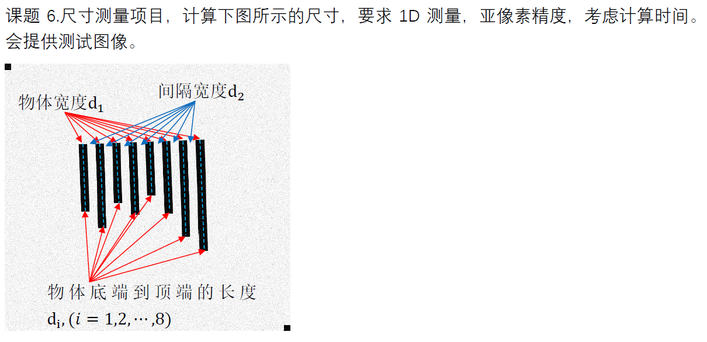
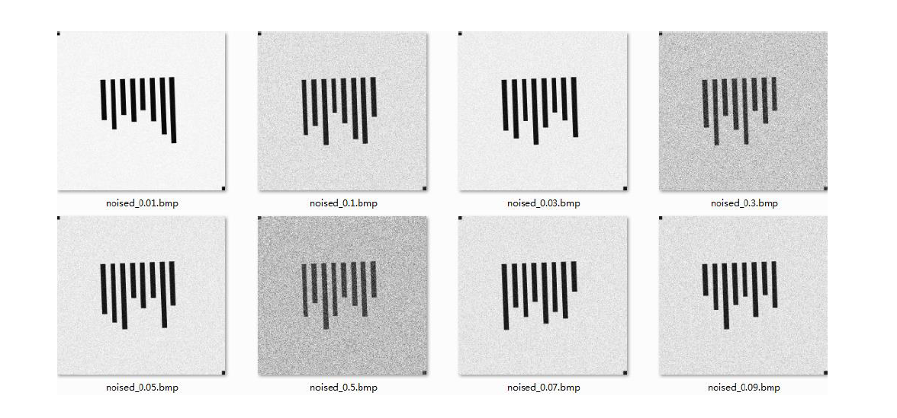
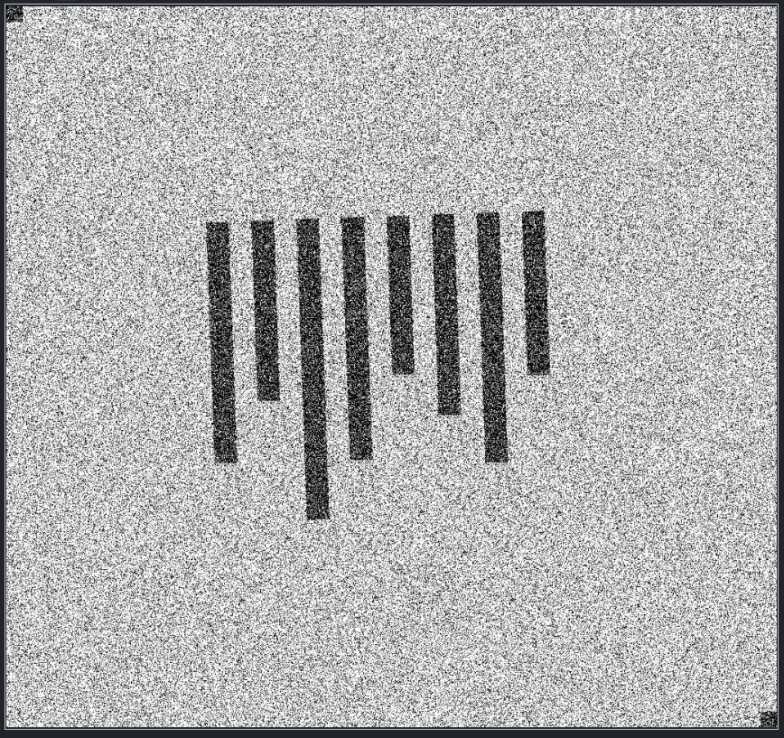
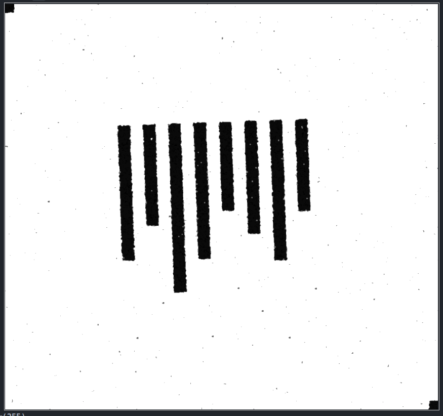
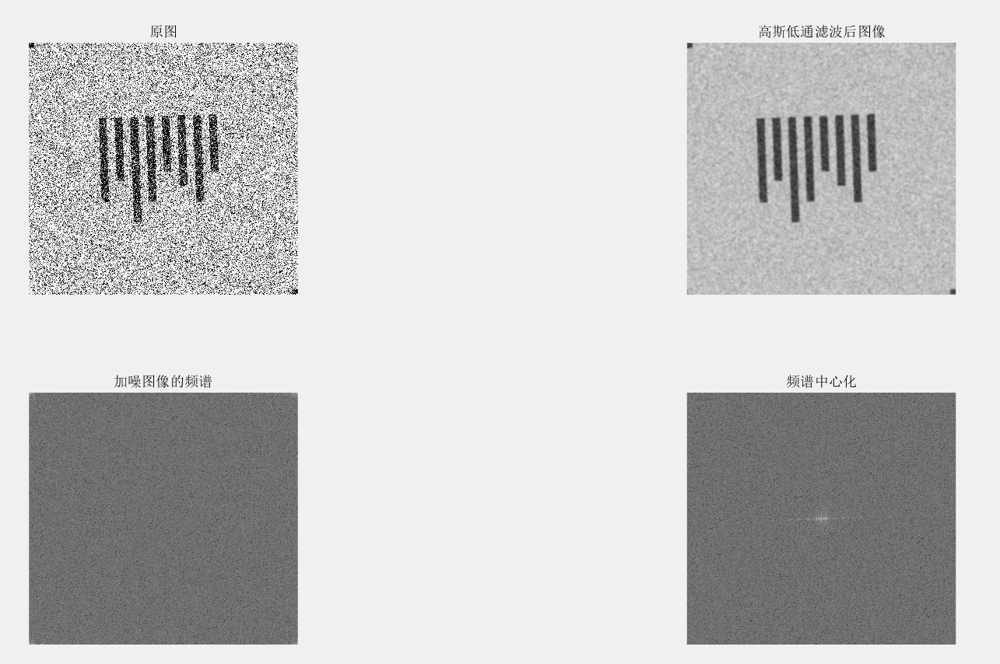
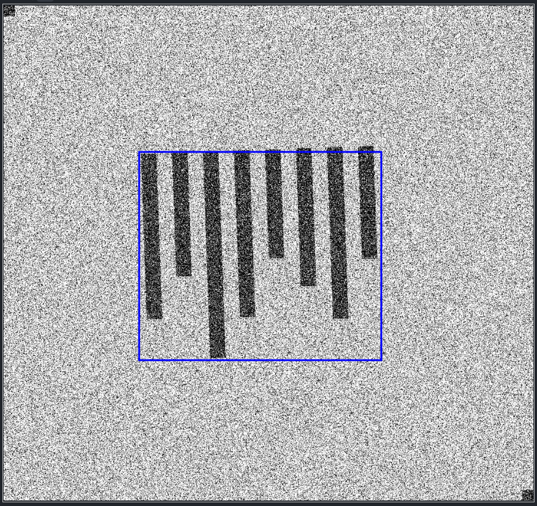
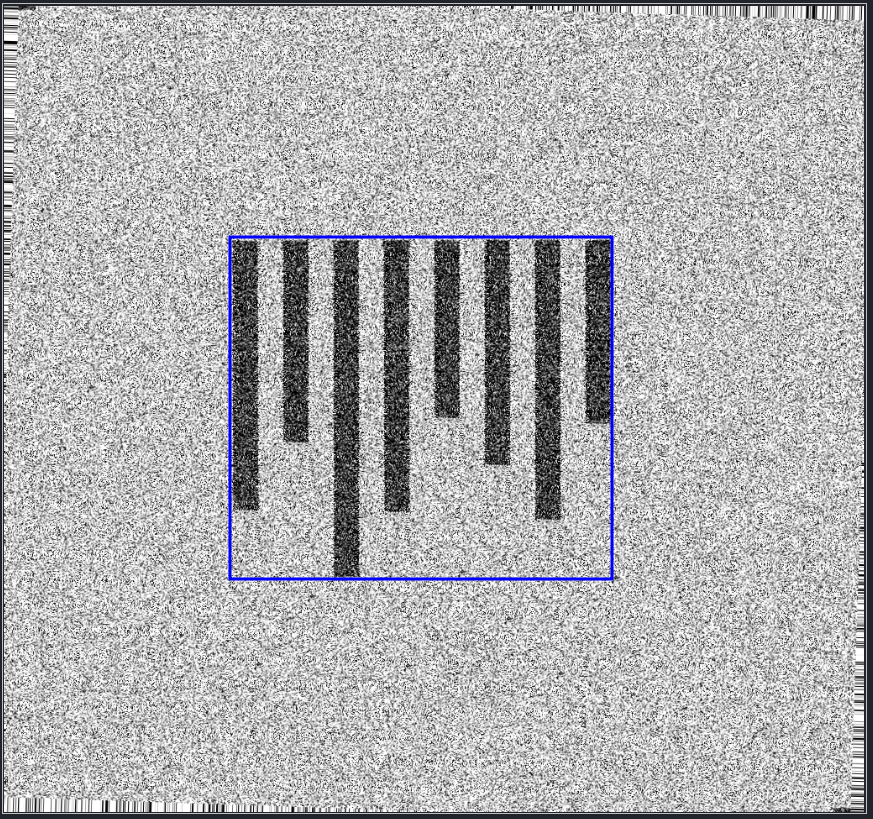

# MV_CourseDesign

> Course design for *Machine Vision*.

## 1 Requirements

## 2 项目要点

### 2.1 对图片进行滤波

1. 采用高斯滤波器进行滤波。
2. 对滤波结果进行开操作，去除小尖峰。
3. 采用多阈值处理方式对图像进行阈值化处理。（数字图像处理，冈萨雷斯）

处理效果

> 尝试频率域滤波，使用了布特沃斯低通滤波器和高斯低通滤波器，发现效果一般，而且计算量很大。遂放弃。
> 
> 

### 2.2 将倾斜的图片旋转矫正

> 原理：在二维傅里叶变换中，空间域中横向的周期变化会反应在频谱图中的横轴上，而空间域中纵向的周期变化会反应在频谱图中的纵轴上。

1. 用DFT变换将图片变换到频域

2. 对得到的频域图像进行二值化

3. 使用Hough变换检测直线，进而得到旋转角度

4. 得到旋转角度后利用仿射变换将图像转正并返回转正图像

处理效果

### 2.3 对处理后的图片进行亚像素精度的1D测量
