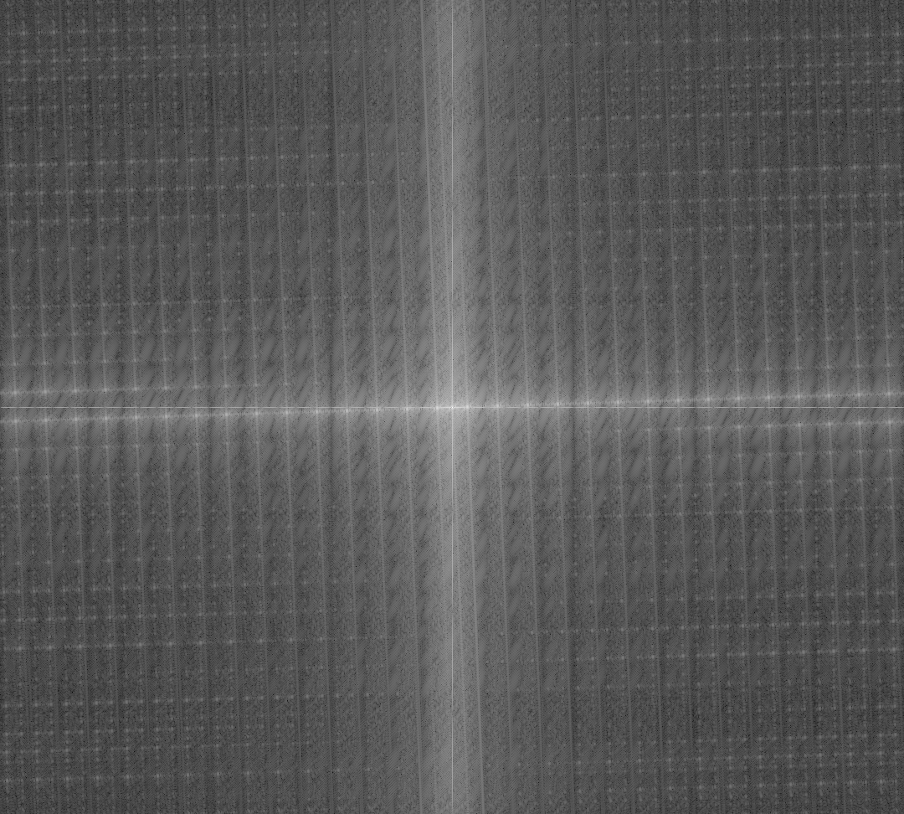

# MV_CourseDesign

> Course design for *Machine Vision*.

## 1 Requirements

## 2 项目要点

### 2.1 对图片进行滤波

1. 采用高斯滤波器进行滤波。
2. 对滤波结果进行开操作，去除小尖峰。
3. 采用多阈值处理方式对图像进行阈值化处理。（数字图像处理，冈萨雷斯）

处理效果

> 尝试频率域滤波，使用了布特沃斯低通滤波器和高斯低通滤波器，发现效果一般，而且计算量很大。遂放弃。
> 
> 
> 
> 

> 由于滤波在降噪的同时也会对图片质量造成影响，因此噪声比较小的图片不滤波的测量结果反而比滤波后测量结果要好。因此考虑对频域计算信噪比，若信噪比数值大于某阈值，则说明图像噪声不明显，跳过滤波步骤。

### 2.2 将倾斜的图片旋转矫正

> 
> 
> 原理：在二维傅里叶变换中，空间域中横向的周期变化会反应在频谱图中的横轴上，而空间域中纵向的周期变化会反应在频谱图中的纵轴上。[Reference: OpenCV Discrete Fourier Transform](https://docs.opencv.org/4.6.0/d8/d01/tutorial_discrete_fourier_transform.html)

1. 用DFT变换将图片变换到频域

2. 对得到的频域图像进行二值化

3. 使用Hough变换检测直线，进而得到旋转角度

4. 得到旋转角度后利用仿射变换将图像转正并返回转正图像

处理效果

### 2.3 对处理后的图片进行亚像素精度的1D测量

1. 从处理好的图像中提取ROI

2. 使用高斯滤波器的一阶导数近似的最优边缘滤波器对ROI进行卷积处理，进行滤波并提取边缘。

3. 取卷积后梯度最大的三个像素点，使用这三个点的坐标用最小二乘法去拟合抛物线$y=ax^2+bx+c$。得到$a$、$b$、$c$的值后求取抛物线对称轴坐标作为亚像素边缘点坐标。

4. 将所有边缘点的坐标存入一个vector，构成一条边缘。

### 2.4 评估

目的：评估测量效果，便于后期调参。

1. 对测量结果进行可视化

2. 计算方差、平均值等
